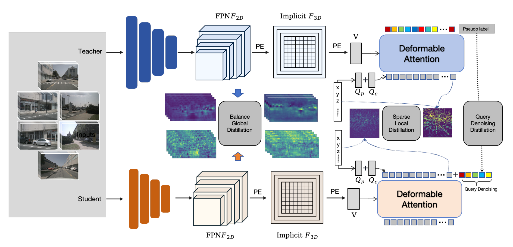

<div align="center">
<h1>HarmoDistill-BEV</h1>
<h1> Bridge the Gap for 3D Query Receptive Field in Multi-Camera BEV Distillation </h1>

</div>

<div align="center">
  
</div><br/>

## Introduction

This repository is an official implementation of [HarmoDistill-BEV: Bridge the Gap for 3D Query Receptive Field in Multi-Camera BEV Distillation](https://openreview.net/attachment?id=2UmcbThFdO&name=pdf). This repository contains Pytorch training code, evaluation code and pre-trained models.

## Getting Started

Our code is built based on [RayDN](https://github.com/LiewFeng/RayDN) and [StreamPETR](https://github.com/exiawsh/StreamPETR). Please follow [StreamPETR](https://github.com/exiawsh/StreamPETR) to [setup enviroment](https://github.com/exiawsh/StreamPETR/blob/main/docs/setup.md) and [prepare data](https://github.com/exiawsh/StreamPETR/blob/main/docs/data_preparation.md) step by step.

## Distillation Training and Inference

### You can distill the model as following:

```angular2html
./tools/dist_distill.sh projects/configs/Distill3D/distill_raydn_r50_r18.py 4
```

### You can evaluate the detection model following:

#### convert distill model into detection model
```angular2html
python tools/distill_convert.py --src_path work_dirs/distill_raydn_r50-18_fpn_bkl_24e_4x4_lr4e-4/latest.pth --dst_path work_dirs/distill_raydn_r50-18_fpn_bkl_24e_4x4_lr4e-4/convert.pth
```
#### evaluate detection model
```angular2html
tools/dist_test.sh projects/configs/RayDN/raydn_r18_704_bs2_seq_428q_nui_60e.py work_dirs/distill_raydn_r50-18_fpn_bkl_24e_4x4_lr4e-4/convert.pth 4 --eval bbox
```

## Results on NuScenes Val Set.

|   Model   |  Setting  | Pretrain | Lr Schd |  NDS  |  mAP  |                                         Config                                         |   Download   | GFLOPs |
| :--------: | :--------: | :------: | :-----: | :---: | :---: | :-------------------------------------------------------------------------------------: | :-----------: | :-----------: |
|   HarmoDistill-RayDN   | R18 - 428q | ImageNet |  24ep  | 52.33 | 40.75 |        [config](projects/configs/RayDN/raydn_r18_flash_704_bs2_seq_428q_nui_60e.py)        | [ckpt](https://pan.baidu.com/s/1Efrz3-YbC-WtTS-Pu_ZD_A) | 57.83
|   HarmoDistill-RayDN   | R34 - 428q | ImageNet |  24ep  | 53.73 | 42.35 |        [config](projects/configs/RayDN/raydn_r34_flash_704_bs2_seq_428q_nui_60e.py)        | [ckpt](https://pan.baidu.com/s/1ofMBR5L3Xy7laYZBWmqG_Q) | 97.78
|   HarmoDistill-RayDN   | R50 - 428q | [NuImg](https://download.openmmlab.com/mmdetection3d/v0.1.0_models/nuimages_semseg/cascade_mask_rcnn_r50_fpn_coco-20e_20e_nuim/cascade_mask_rcnn_r50_fpn_coco-20e_20e_nuim_20201009_124951-40963960.pth) |  24ep  | 55.62 | 45.78 |        [config](projects/configs/RayDN/raydn_r50_flash_704_bs2_seq_428q_nui_60e.py)        | [ckpt](https://pan.baidu.com/s/1CMm8FdzMkWE24QboK908nQ) | 110.27
| HarmoDistill-StreamPETR | R50 - 428q | [NuImg](https://download.openmmlab.com/mmdetection3d/v0.1.0_models/nuimages_semseg/cascade_mask_rcnn_r50_fpn_coco-20e_20e_nuim/cascade_mask_rcnn_r50_fpn_coco-20e_20e_nuim_20201009_124951-40963960.pth) |  24ep  | 53.06 | 43.91 | [config](projects/configs/StreamPETR/stream_petr_r50_flash_704_bs4_seq_428q_nui_24e.py.py) | [ckpt](https://pan.baidu.com/s/1mnhkKasLfe-ckfC_hTrGug) | 105.03

This repository is an official implementation of HarmoDistill-BEV.

## Getting Started

Please follow our documentation step by step. If you like our work, please recommend it to your colleagues and friends.

1. [**Environment Setup.**](./docs/setup.md)
2. [**Data Preparation.**](./docs/data_preparation.md)
3. [**Training and Inference.**](./docs/training_inference.md)


## Acknowledgements

We thank these great works and open-source codebases:
[MMDetection3d](https://github.com/open-mmlab/mmdetection3d), [StreamPETR](https://github.com/exiawsh/StreamPETR), [DETR3D](https://github.com/WangYueFt/detr3d), [PETR](https://github.com/megvii-research/PETR).

* 3D Detection. [MMDetection3d](https://github.com/open-mmlab/mmdetection3d), [DETR3D](https://github.com/WangYueFt/detr3d), [PETR](https://github.com/megvii-research/PETR), [BEVFormer](https://github.com/fundamentalvision/BEVFormer), [SOLOFusion](https://github.com/Divadi/SOLOFusion), [Sparse4D](https://github.com/linxuewu/Sparse4D).
* Multi-object tracking. [MOTR](https://github.com/megvii-research/MOTR), [PF-Track](https://github.com/TRI-ML/PF-Track).

## Citation
<!-- 
If you find RayDN is useful in your research or applications, please consider giving us a star 🌟 and citing it by the following BibTeX entry.

```bibtex
@article{liu2024ray,
  title={Ray Denoising: Depth-aware Hard Negative Sampling for Multi-view 3D Object Detection},
  author={Liu, Feng and Huang, Tengteng and Zhang, Qianjing and Yao, Haotian and Zhang, Chi and Wan, Fang and Ye, Qixiang and Zhou, Yanzhao},
  journal={arXiv preprint arXiv:2402.03634},
  year={2024}
}
```

If you find StreamPETR is useful in your research or applications, please consider giving us a star 🌟 and citing it by the following BibTeX entry.

```bibtex
@article{wang2023exploring,
  title={Exploring Object-Centric Temporal Modeling for Efficient Multi-View 3D Object Detection},
  author={Wang, Shihao and Liu, Yingfei and Wang, Tiancai and Li, Ying and Zhang, Xiangyu},
  journal={arXiv preprint arXiv:2303.11926},
  year={2023}
}
``` -->
